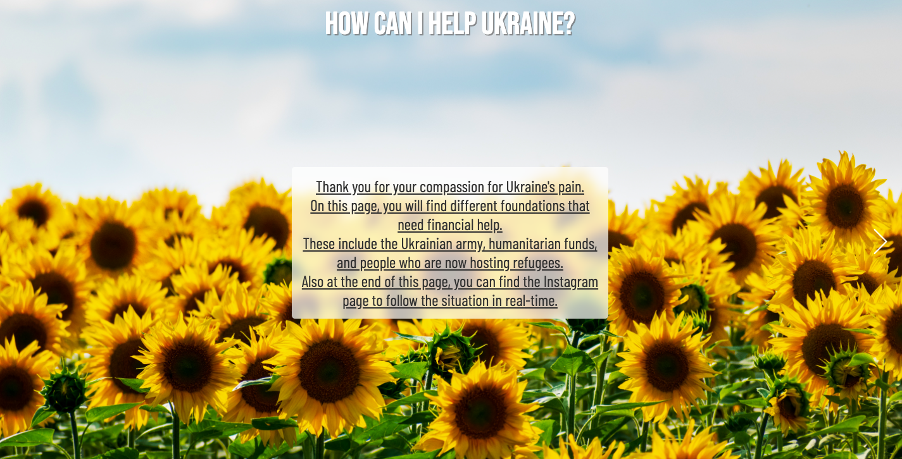

# standWithUkraine

On the 24th of February 2022, Russia invaded the sovereign and independent country Ukraine.

Since that day, for every Ukrainian, no matter where he or she is, life has changed from before and after.
Thank you to the world for the support you provide on every level you can.

This site is a collection of foundations and individuals to whom you can financially help.

🌻 In the background image are the colors of Ukraine's flag - is a field of sunflowers and the peaceful blue sky, which it will certainly become after Ukraine's victory over the occupiers.

The yellow color of the sunflower is a symbol of faith in the best, respect, and joy. Ukraine will definitely win! 🇺🇦 

